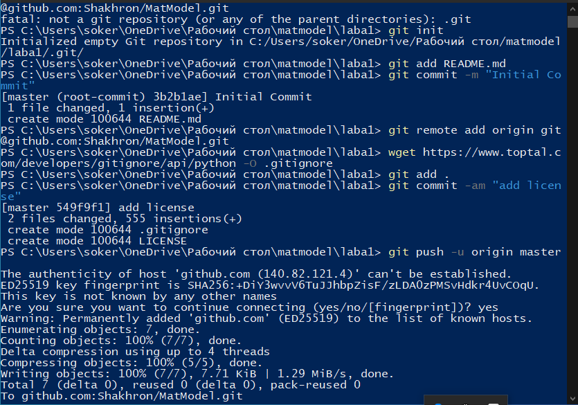
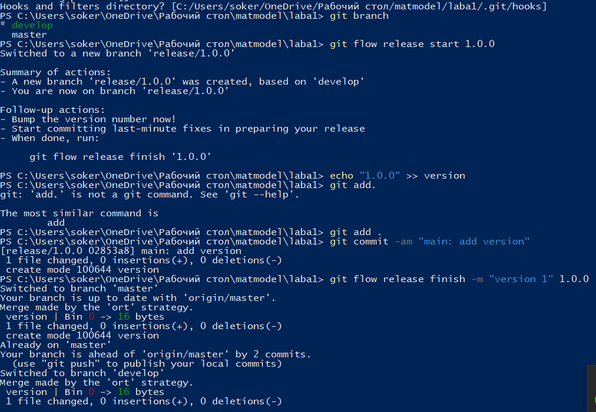
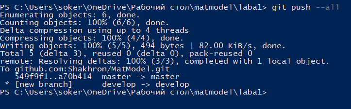
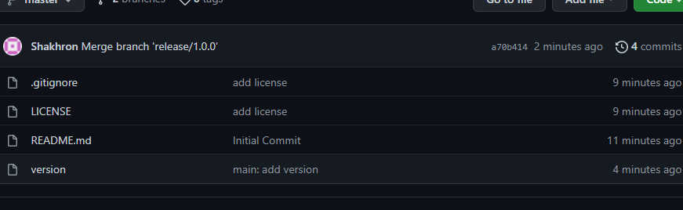

---
## Front matter
lang: ru-RU
title: Лабораторная работа 1
author: Файзуллоев Шахрон НПИбд-02-19
institute: Российский Университет Дружбы Народов
date: 11 февраля, 2022, Москва, Россия

## Formatting
mainfont: PT Serif
romanfont: PT Serif
sansfont: PT Sans
monofont: PT Mono
toc: false
slide_level: 2
theme: metropolis
header-includes: 
 - \metroset{progressbar=frametitle,sectionpage=progressbar,numbering=fraction}
 - '\makeatletter'
 - '\beamer@ignorenonframefalse'
 - '\makeatother'
aspectratio: 43
section-titles: true

---

# Цели и задачи работы

## Цель лабораторной работы

Целью данной работы является изучение средств контроля версий.

## Задачи лабораторной работы

1. Создать учетную запись на github.com

2. Настроить репозиторий

3. Изучить механизм управления версиями

# Процесс выполнения лабораторной работы

## Инициализируем локальный репозиторий

{ #fig:001 width=70% height=70% }

## Использование системы управления версиями

{ #fig:002 width=70% height=70% }

## Использование системы управления версиями

{ #fig:008 width=70% height=70% }

## Завершение релиза и отправка изменений в сетевой репозиторий

{ #fig:004 width=70% height=70% }

# Выводы по проделанной работе

## Вывод

Мы приобрели практические навыки работы с системой контроля версий git и создали свой репозиторий