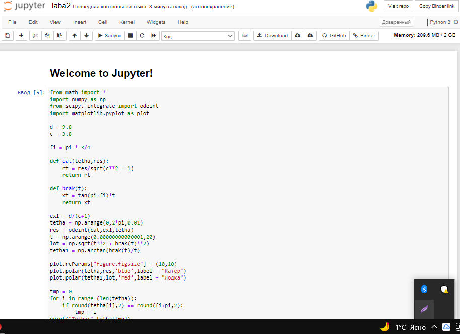
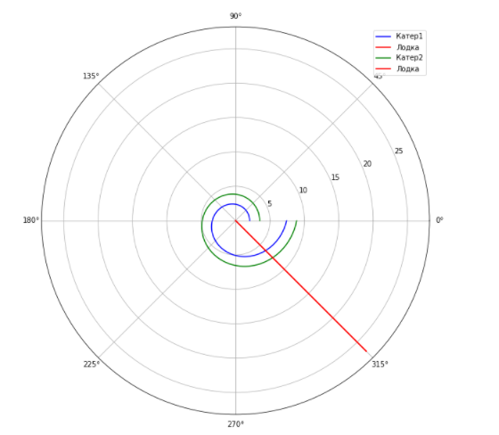

---
## Front matter
lang: ru-RU
title: Задача о погоне
author: |
	 Файзуллоев Шахрон	НПИбд-02-19\inst{1}

institute: |
	\inst{1}Российский Университет Дружбы Народов

date: 18 февраля, 2022, Москва, Россия

## Formatting
mainfont: PT Serif
romanfont: PT Serif
sansfont: PT Sans
monofont: PT Mono
toc: false
slide_level: 2
theme: metropolis
header-includes: 
 - \metroset{progressbar=frametitle,sectionpage=progressbar,numbering=fraction}
 - '\makeatletter'
 - '\beamer@ignorenonframefalse'
 - '\makeatother'
aspectratio: 43
section-titles: true

---

# Цели и задачи работы

## Цель лабораторной работы

Построения математических моделей для выбора правильной стратегии при решении задач поиска.
Необходимо определить по какой траектории необходимо двигаться катеру, чтоб нагнать лодку.

## Задание к лабораторной работе

1. Провести необходимые рассуждения и вывод дифференциальных уравнений, если скорость катера больше скорости лодки в n раз.
2. Построить траекторию движения катера и лодки для двух случаев. 
3. Определить по графику точку пересечения катера и лодки.

# Процесс выполнения лабораторной работы

## Условие задачи

На море в тумане катер береговой охраны преследует лодку браконьеров.
Через определенный промежуток времени туман рассеивается, и лодка
обнаруживается на расстоянии 9,8 км от катера. Затем лодка снова скрывается в
тумане и уходит прямолинейно в неизвестном направлении. Известно, что скорость
катера в 3,8 раза больше скорости браконьерской лодки.

## Теоретический материал 

Решение исходной задачи сводится к решению системы из двух дифференциальных уравнений 

$$
 \begin{cases}
   \frac{dr}{dt}=υ
	\\   
	r\frac{d\theta}{dt}=υ\sqrt{n^2-1}
 \end{cases}
$$

с начальными условиями

$$
 \begin{cases}
   \theta_0=0
   \\
	r_0=\frac{k}{n+1}
 \end{cases}
\
$$

$$
 \begin{cases}
   \theta_0=-\pi
   \\
	r_0=\frac{k}{n-1}
 \end{cases}
\
$$

## Теоретический материал 

Исключая из полученной системы производную по t, можно перейти к следующему уравнению: $\frac{dr}{d\theta}=\frac{r}{\sqrt{n^2-1}}$

Начальные условия остаются прежними. Решив это уравнение, мы получим
траекторию движения катера в полярных координатах. 

## Процесс выполнения

{ #fig:001 width=70% height=70% }

## Результаты

{ #fig:002 width=70% height=70% }

Для первого случая точка пересечения красного и синего графиков - точка пересечения катера и лодки, исходя из графика, имеет координаты
$$
 \begin{cases}
   \theta=315
   \\
  r=6.16
 \end{cases}
\
$$

## Результаты

{ #fig:003 width=70% height=70% }

Для второго случая точка пересечения красного и зеленого графиков - точка пересечения катера и лодки, исходя из графика, имеет координаты
$$
 \begin{cases}
   \theta=315
   \\
  r=7.62
 \end{cases}
\
$$

# Выводы по проделанной работе

## Вывод

Наблюдаем, что при погоне «по часовой стрелке» для достижения цели потребуется пройти значительно меньшее расстояние

Построили математические модели для выбора правильной стратегии при решении задач поиска.
Определить по какой траектории необходимо двигаться катеру, чтоб нагнать лодку.

